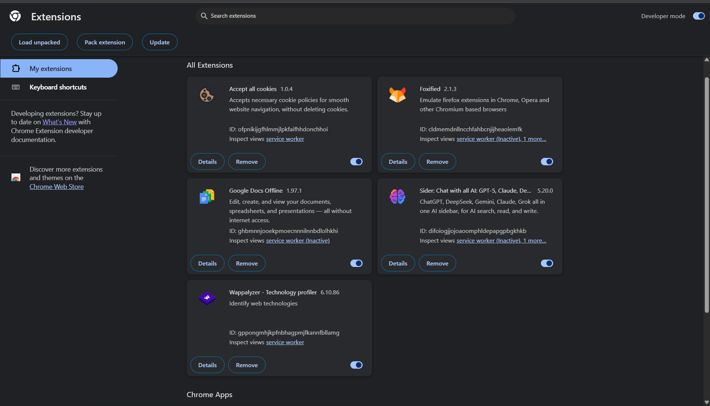

# Cybersecurity-Internship-Task-7
This repository contains the submission for the Cybersecurity Internship Task 7, focusing on browser security and extension management

# Task 7: Identify and Remove Suspicious Browser Extensions

### Cybersecurity Internship Task

---

## 1. Objective
The objective of this task is to learn how to spot and remove potentially harmful browser extensions. This helps in building awareness about browser security risks and managing browser extensions effectively.

## 2. Audit Process and Findings
I began by reviewing all installed extensions on my browser's extensions management page (`chrome://extensions`).

* **Audit Steps:**
    1.  I carefully reviewed the **permissions** and **online reviews** for each installed extension.
    2.  I specifically looked for any extensions that were unused or looked suspicious.
    3.  I verified that all extensions were from the official Chrome Web Store.

* **Findings:**
    During my audit, I **did not find any suspicious or malicious extensions**. All installed extensions (such as Google Docs Offline, Wappalyzer, etc.) are from legitimate publishers and are necessary for my specific workflow. Therefore, no extensions were removed.

### Installed Extensions (Screenshot)
(Place your screenshot file, e.g., `extensions_audit.png`, in the same repository folder)

## 3. Research: How Malicious Extensions Harm Users
Even though my browser was clean, I researched the methods malicious extensions use to harm users:

* **Data Theft:** Extensions with "read and change all data" permissions can scrape sensitive information like passwords, credit card numbers, and browsing history from web pages.
* **Ad Hijacking & Injection:** They can forcibly inject unwanted ads into websites or hijack search results to redirect users to spammy or malicious sites.
* **Phishing:** A malicious extension can overlay a fake login screen on a legitimate website (like a bank) to steal user credentials.
* **Keystroke Logging:** Some extensions can record every key you press, capturing all sensitive data, including messages and passwords, as you type them.

## 4. Outcome
[cite_start]Through this task, I have gained a better awareness of the security risks associated with browser extensions and learned the proper steps to audit and manage them safely[cite: 16].
